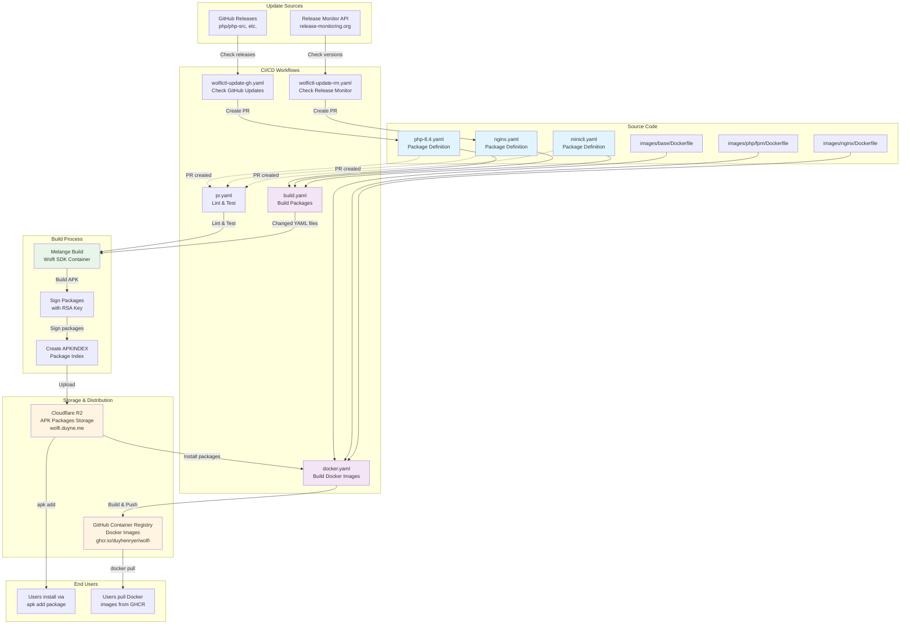
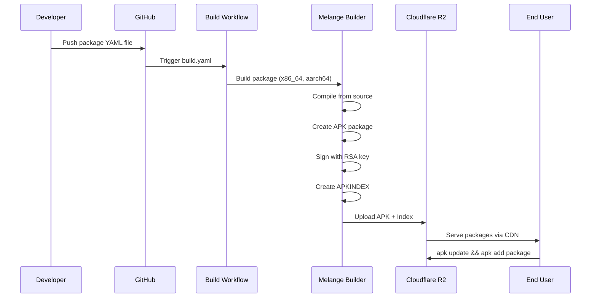
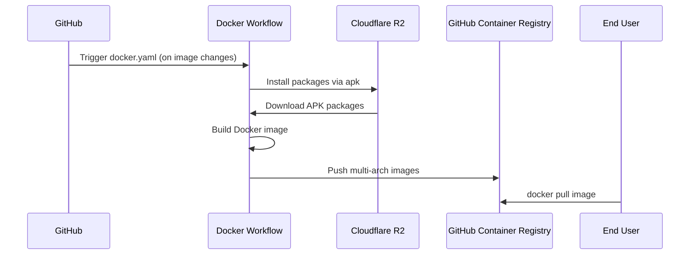
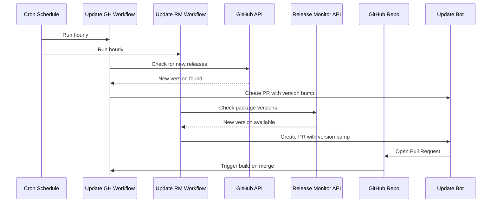

# Wolfi Packages Repository Architecture

```mermaid
graph TB
    subgraph "Source Code"
        PKG1[php-8.4.yaml<br/>Package Definition]
        PKG2[nginx.yaml<br/>Package Definition]
        PKG3[minicli.yaml<br/>Package Definition]
        DOCKER1[images/base/Dockerfile]
        DOCKER2[images/php/fpm/Dockerfile]
        DOCKER3[images/nginx/Dockerfile]
    end

    subgraph "CI/CD Workflows"
        WF_BUILD[build.yaml<br/>Build Packages]
        WF_PR[pr.yaml<br/>Lint & Test]
        WF_UPDATE_GH[wolfictl-update-gh.yaml<br/>Check GitHub Updates]
        WF_UPDATE_RM[wolfictl-update-rm.yaml<br/>Check Release Monitor]
        WF_DOCKER[docker.yaml<br/>Build Docker Images]
    end

    subgraph "Build Process"
        MELANGE[Melange Build<br/>Wolfi SDK Container]
        SIGN[Sign Packages<br/>with RSA Key]
        INDEX[Create APKINDEX<br/>Package Index]
    end

    subgraph "Storage & Distribution"
        R2[Cloudflare R2<br/>APK Packages Storage<br/>wolfi.duyne.me]
        GHCR[GitHub Container Registry<br/>Docker Images<br/>ghcr.io/duyhenryer/wolfi]
    end

    subgraph "Update Sources"
        GITHUB[GitHub Releases<br/>php/php-src, etc.]
        RELEASE_MONITOR[Release Monitor API<br/>release-monitoring.org]
    end

    subgraph "End Users"
        USER1[Users install via<br/>apk add package]
        USER2[Users pull Docker<br/>images from GHCR]
    end

    %% Package Definition Flow
    PKG1 --> WF_BUILD
    PKG2 --> WF_BUILD
    PKG3 --> WF_BUILD
    
    %% PR Flow
    PKG1 -.->|PR created| WF_PR
    PKG2 -.->|PR created| WF_PR
    PKG3 -.->|PR created| WF_PR
    WF_PR -->|Lint & Test| MELANGE

    %% Build Flow
    WF_BUILD -->|Changed YAML files| MELANGE
    MELANGE -->|Build APK| SIGN
    SIGN -->|Sign packages| INDEX
    INDEX -->|Upload| R2

    %% Update Flow
    GITHUB -->|Check releases| WF_UPDATE_GH
    RELEASE_MONITOR -->|Check versions| WF_UPDATE_RM
    WF_UPDATE_GH -->|Create PR| PKG1
    WF_UPDATE_RM -->|Create PR| PKG2

    %% Docker Build Flow
    DOCKER1 --> WF_DOCKER
    DOCKER2 --> WF_DOCKER
    DOCKER3 --> WF_DOCKER
    R2 -->|Install packages| WF_DOCKER
    WF_DOCKER -->|Build & Push| GHCR

    %% User Flow
    R2 -->|apk add| USER1
    GHCR -->|docker pull| USER2

    style PKG1 fill:#e1f5ff
    style PKG2 fill:#e1f5ff
    style PKG3 fill:#e1f5ff
    style R2 fill:#fff4e1
    style GHCR fill:#fff4e1
    style MELANGE fill:#e8f5e9
    style WF_BUILD fill:#f3e5f5
    style WF_DOCKER fill:#f3e5f5
```

## Package Build Flow

```mermaid
sequenceDiagram
    participant Dev as Developer
    participant GH as GitHub
    participant WF as Build Workflow
    participant Melange as Melange Builder
    participant R2 as Cloudflare R2
    participant User as End User

    Dev->>GH: Push package YAML file
    GH->>WF: Trigger build.yaml
    WF->>Melange: Build package (x86_64, aarch64)
    Melange->>Melange: Compile from source
    Melange->>Melange: Create APK package
    Melange->>Melange: Sign with RSA key
    Melange->>Melange: Create APKINDEX
    Melange->>R2: Upload APK + Index
    R2->>User: Serve packages via CDN
    User->>R2: apk update && apk add package
```

## Docker Image Build Flow

```mermaid
sequenceDiagram
    participant GH as GitHub
    participant WF as Docker Workflow
    participant R2 as Cloudflare R2
    participant GHCR as GitHub Container Registry
    participant User as End User

    GH->>WF: Trigger docker.yaml (on image changes)
    WF->>R2: Install packages via apk
    R2->>WF: Download APK packages
    WF->>WF: Build Docker image
    WF->>GHCR: Push multi-arch images
    User->>GHCR: docker pull image
```

## Auto-Update Flow

```mermaid
sequenceDiagram
    participant Schedule as Cron Schedule
    participant WF_GH as Update GH Workflow
    participant WF_RM as Update RM Workflow
    participant GitHub as GitHub API
    participant RM as Release Monitor API
    participant GH as GitHub Repo
    participant Bot as Update Bot

    Schedule->>WF_GH: Run hourly
    Schedule->>WF_RM: Run hourly
    
    WF_GH->>GitHub: Check for new releases
    GitHub-->>WF_GH: New version found
    WF_GH->>Bot: Create PR with version bump
    
    WF_RM->>RM: Check package versions
    RM-->>WF_RM: New version available
    WF_RM->>Bot: Create PR with version bump
    
    Bot->>GH: Open Pull Request
    GH->>WF_GH: Trigger build on merge
```
